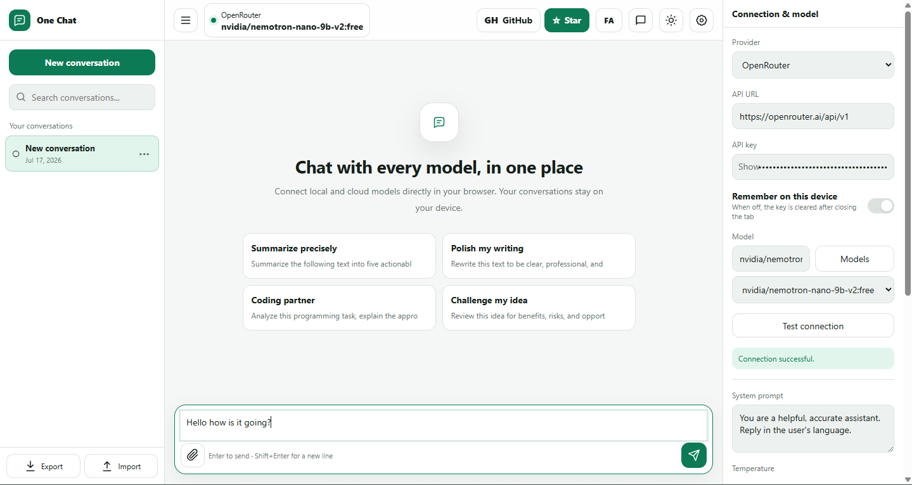
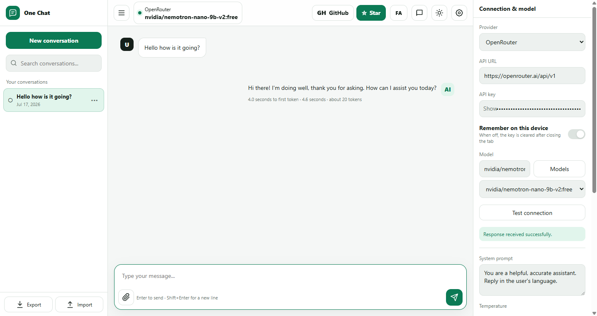

# One Chat

🌐 **Languages:** English | [فارسی](README.fa.md)

One Chat is a lightweight AI chat interface designed to work with both local models and cloud AI services. Instead of using a different interface for every provider, you can open a single page, connect your preferred model, and start chatting.

The entire application is contained in a single HTML file. There is nothing to install, no build process, and no backend server required.

## Supported Providers

One Chat supports the following providers out of the box:

- Ollama
- LM Studio
- OpenRouter
- OpenAI
- Groq
- Together AI
- Fireworks AI
- DeepSeek
- Google Gemini
- Chrome AI (Gemini Nano)
- 9Router
- Any OpenAI-compatible API

Local providers such as Ollama and LM Studio usually do not require an API key. Cloud providers require the corresponding API key.

## Features

- Lightweight single-file application with no dependencies
- Connect to both local and cloud AI models
- Streaming responses in real time
- Markdown rendering with tables, lists, blockquotes, and code blocks
- Copy buttons for responses and code snippets
- Compare mode for querying two models side by side
- Configurable System Prompt, Temperature, and Max Tokens
- Upload text files, JSON, Markdown, and images
- Save and search chat history
- Export conversations as Markdown
- Backup and restore application data
- Built-in prompt library
- English and Persian interface
- Light and dark themes
- Responsive design for desktop and mobile

## Getting Started

1. Download `one-chat.html`.
2. Open it in a modern browser such as Chrome, Edge, or Firefox.
3. Open **Settings** and select your provider.
4. Enter the API endpoint, model name, and API key (if required).
5. Click **Test Connection**, then start chatting.

That's it—no installation or build step is required.

## Connecting to Ollama

Make sure Ollama is running and the model you want to use is already available.

In One Chat:

- Select `Ollama` as the provider.
- Leave the default endpoint as `http://localhost:11434/v1`.
- Enter your installed model name (for example, `llama3.2`).
- Click **Test Connection**.

If your browser blocks the connection, enable CORS for the page origin in your Ollama configuration.

## Connecting to LM Studio

Start the local server in LM Studio, then:

- Select `LM Studio` as the provider.
- Verify the default endpoint: `http://localhost:1234/v1`.
- Enter the loaded model name.
- Click **Test Connection**.

If the connection fails, check the LM Studio server's CORS settings.

## Connecting to Other APIs

If your provider exposes an OpenAI-compatible API, select **OpenAI Compatible** and enter:

- The API base URL (usually ending with `/v1`)
- The exact model name
- Your API key (if required)

You can also use the **Additional JSON Parameters** field to pass options such as `top_p`.

## Privacy & API Keys

Chats and settings are stored locally in your browser. One Chat does not use an intermediary server—requests are sent directly from your browser to the selected provider.

If **Save API Key** is disabled, your API key is kept only until the browser tab is closed. If enabled, the key is stored in your browser's local storage. For security reasons, avoid enabling this option on shared or public computers.

When creating a backup, you can choose whether API keys should be included. For better security, it is recommended to exclude them.

## Troubleshooting

If you cannot connect, check the following:

- Make sure the local model or server is running.
- Verify the API endpoint and model name.
- Ensure your API key is valid.
- Confirm that your browser can access the model endpoint.
- Enable CORS on your local server if necessary.
- If you opened the application using `file://` and your provider blocks the connection, serve the file through a simple local web server.

---

One Chat is not intended to replace large, feature-rich AI clients. It is designed to be a simple, lightweight, and independent interface that lets you connect to your preferred AI model and start chatting in seconds.